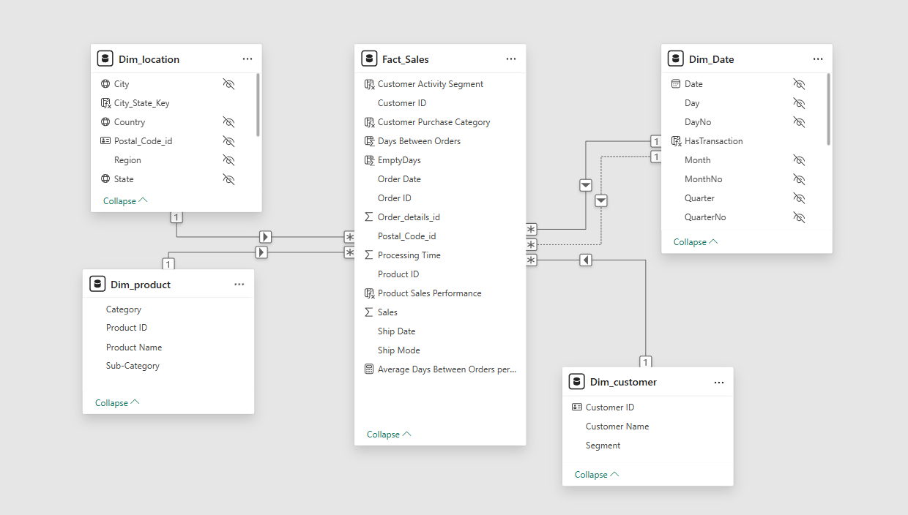

# 🛍️ Superstore Sales Analysis Project

## 📌 Project Overview and Objectives

This project focuses on analyzing and visualizing key business performance metrics for a retail company using Power BI. The goal is to derive actionable insights into:

* Sales performance
* Product effectiveness
* Customer behavior

By understanding these factors, the project supports data-driven decision-making and offers strategic recommendations to enhance operations and profitability.

---

## 🧠 Problem Statement

Many businesses hold large amounts of data but struggle to convert it into meaningful insights. This project tackles that issue by transforming raw Superstore data into a visual and interactive analytical model that helps uncover strengths, weaknesses, trends, and opportunities.

---

## 🎯 Objectives

* Understand sales trends and regional performance
* Identify customer segments and buying behavior
* Detect high- and low-performing products
* Provide strategic, data-backed recommendations

---

## 📂 Dataset Overview

The dataset represents sales data for a retail company from **March 1, 2015, to December 30, 2018**. It includes:

* Transaction records
* Product details
* Customer data
* Location and shipping info

This data allows for deep analysis of trends, performance gaps, and customer preferences.

📸 *Sample data preview will be shown here (image placeholder)*


---

## 🔄 Project Workflow
.png?raw=true)

### 1. **Data Import**

Collected sales, customer, and product data from multiple sources into Power BI.

### 2. **Data Cleaning**

Removed duplicates, fixed errors, and handled missing values to ensure data accuracy.

### 3. **Data Preprocessing**

Transformed columns, added calculated fields, and ensured proper data types.

📸 **

### 4. **Data Modeling**

Created a Star Schema model using:

* Fact table: `Fact_Sales`
* Dimension tables: `Dim_Date`, `Dim_Product`, `Dim_Customer`, `Dim_Location`

📸 **

### 5. **Data Analysis & Visualization**

Built multiple dashboards with KPIs, charts, and maps for deep business insights.

---

## 📊 Dashboards

Below are sample dashboard views created using Power BI:

📸 **
📸 **
📸 **
📸 **
📸 **
📸 **

---

## 🧠 Key Insights

* California drives over 60% of sales in the West → high dependency
* Technology is the highest-grossing category
* Office Supplies has the highest order volume but lowest value
* 6% of customers bought less than 3 times → opportunity for re-engagement
* Orders are higher on weekends but Thursdays show the weakest activity

---

## ✅ Recommendations

* Launch targeted campaigns in low-performing regions
* Use referral and loyalty programs to retain and grow customer base
* Create bundle offers for low-performing products (especially in Technology)
* Promote weekend deals and boost Thursday activity with special offers

---

## 👥 Team Members

* \[Your Name] — Data Analyst & Visualization
* \[Team Member 2] — Data Cleaning & Modeling
* \[Team Member 3] — Insight Extraction & Report Writing

---

## 🛠️ Tools Used

* Power BI
* DAX (Data Analysis Expressions)
* Star Schema Modeling

---

## 📌 Conclusion

This Power BI project demonstrates how businesses can transform raw data into strategic insights. Through strong modeling and meaningful visualization, we provided clear recommendations to improve decision-making, enhance customer experience, and increase profitability.

---

## 📁 Folder Structure (Suggested for GitHub)

```
📦 Superstore-Sales-Analysis
├── images/                  # Dashboard screenshots
├── Superstore.pbix          # Power BI report file
├── README.md                # Project documentation
└── LICENSE                  # Optional (e.g., MIT)
```

---

> For any questions or feedback, feel free to open an issue or contribute!
